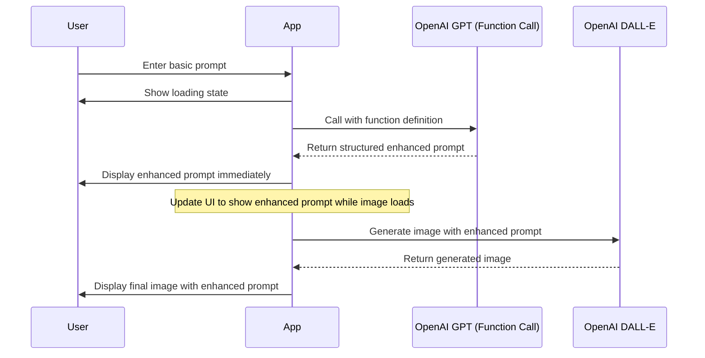

# Enhanced Image Generation with Improved Prompts - Updated Plan

This document outlines the updated implementation plan for improving the image generation feature by enhancing user prompts with more descriptive details and showing progress to the user.

## 1. Updated System Architecture



## 2. Detailed Code Changes

### A. Update Message Type in src/types/chat.ts

```typescript
export interface Message {
  type: 'user' | 'assistant'
  content: string[]
  enhancedPrompt?: string // New field to store the enhanced prompt
  isError: boolean
  isLoading?: boolean
  imageMeta?: ImageMeta
  timestamp: number
  model?: string | ''
}
```

### B. Enhance the Chat Store (src/stores/chat.ts)

1. Add the function to enhance prompts using OpenAI function calling (unchanged):

```typescript
async enhancePrompt(userPrompt: string): Promise<string> {
  const { apiKey } = useConfigStore.getState()
  
  if (!apiKey) {
    return userPrompt; // Return original if no API key
  }
  
  const openai = new OpenAI({
    apiKey: apiKey,
    dangerouslyAllowBrowser: true,
  })
  
  try {
    const response = await openai.chat.completions.create({
      model: "gpt-4", // Or gpt-3.5-turbo if preferred
      messages: [
        {
          role: "system",
          content: "You are an expert at enhancing image generation prompts. Add more descriptive details while maintaining the user's original intent. Don't change the subject or style, just make it more detailed and vivid."
        },
        {
          role: "user",
          content: `Original prompt: "${userPrompt}"`
        }
      ],
      functions: [
        {
          name: "enhance_image_prompt",
          description: "Enhance an image generation prompt with more descriptive details",
          parameters: {
            type: "object",
            properties: {
              enhancedPrompt: {
                type: "string",
                description: "The enhanced prompt with more descriptive details while maintaining the original intent"
              }
            },
            required: ["enhancedPrompt"]
          }
        }
      ],
      function_call: { name: "enhance_image_prompt" }
    })
    
    const functionCall = response.choices[0]?.message?.function_call
    
    if (functionCall && functionCall.name === "enhance_image_prompt") {
      try {
        const args = JSON.parse(functionCall.arguments)
        return args.enhancedPrompt
      } catch (e) {
        console.error("Error parsing function call arguments:", e)
      }
    }
  } catch (error) {
    console.error("Error enhancing prompt:", error)
  }
  
  // Fallback to original prompt if anything fails
  return userPrompt
}
```

2. Modify the `addMessage` function to show progress by updating the loading message with the enhanced prompt:

```typescript
async addMessage() {
  const { style, size, apiKey, quality, model, noImage } = useConfigStore.getState()
  if (!apiKey) {
    get().toggleApiKeyDialog(true)
    return
  }

  const currentTopic = get().topics.find((t) => t.id === get().currentTopicId)
  if (!currentTopic) {
    // Create a new topic if none is selected
    get().createTopic(get().inputPrompt.slice(0, 30) + '...')
  }

  if (get().isGenerating) return

  const userPrompt = get().inputPrompt
  
  // Create user message with original prompt
  const newMessage: Message = {
    type: 'user',
    content: [userPrompt],
    isError: false,
    timestamp: Date.now(),
    model: model || '',
  }

  // Create initial loading message
  const loadingMessage: Message = {
    type: 'assistant',
    content: [''],
    isError: false,
    isLoading: true,
    timestamp: Date.now(),
    model: model || '',
  }

  set((state) => ({
    isGenerating: true,
    topics: state.topics.map((topic) =>
      topic.id === state.currentTopicId
        ? {
            ...topic,
            messages: [...topic.messages, newMessage, loadingMessage],
            updatedAt: Date.now(),
          }
        : topic,
    ),
  }))

  // Generate enhanced prompt
  let enhancedPrompt: string;
  try {
    enhancedPrompt = await get().enhancePrompt(userPrompt)
    
    // Update loading message with enhanced prompt to show progress
    set((state) => ({
      topics: state.topics.map((topic) =>
        topic.id === state.currentTopicId
          ? {
              ...topic,
              messages: [
                ...topic.messages.slice(0, -1),
                {
                  ...topic.messages[topic.messages.length - 1],
                  enhancedPrompt: enhancedPrompt,
                  content: ['Generating image...'],
                },
              ],
              updatedAt: Date.now(),
            }
          : topic,
      ),
    }))
  } catch (error) {
    console.error("Failed to enhance prompt:", error)
    enhancedPrompt = userPrompt // Fallback to original
  }

  const openai = new OpenAI({
    apiKey: apiKey,
    dangerouslyAllowBrowser: true,
  })

  const options: ImageGenerateParams = {
    prompt: enhancedPrompt, // Use enhanced prompt for image generation
    model: model || 'dall-e-3',
    n: model === 'dall-e-3' ? 1 : noImage,
    response_format: 'b64_json',
    size: size || '1024x1024',
    style: style || 'vivid',
    quality: quality || 'standard',
  }

  controller = new AbortController()
  const signal = controller.signal

  try {
    const completion = await openai.images.generate(options, {
      signal: signal,
    })
    const base64 = (completion.data?.map((image) => image.b64_json)?.filter((img) => img) as string[]) || []
    if (base64?.length === 0) throw new Error('invalid base64')

    const key: string[] = []
    for (const image of base64) {
      const uuid = await imageStore.storeImage('data:image/png;base64,' + image)
      key.push(uuid)
    }

    const imageMeta: ImageMeta = {
      style: useConfigStore.getState().style || 'vivid',
      size: useConfigStore.getState().size || '1024x1024',
      quality: useConfigStore.getState().quality || 'standard',
    }

    set((state) => ({
      inputPrompt: '',
      topics: state.topics.map((topic) =>
        topic.id === state.currentTopicId
          ? {
              ...topic,
              messages: [
                ...topic.messages.slice(0, -1),
                {
                  type: 'assistant',
                  model: model || '',
                  content: key,
                  enhancedPrompt: enhancedPrompt,
                  imageMeta,
                  isError: false,
                  timestamp: Date.now(),
                },
              ],
              updatedAt: Date.now(),
            }
          : topic,
      ),
    }))
  } catch (error: any) {
    set((state) => ({
      topics: state.topics.map((topic) =>
        topic.id === state.currentTopicId
          ? {
              ...topic,
              messages: [
                ...topic.messages.slice(0, -1),
                {
                  type: 'assistant',
                  content: [error.message || 'Unknown error'],
                  enhancedPrompt: enhancedPrompt, // Preserve enhanced prompt even on error
                  isError: true,
                  timestamp: Date.now(),
                },
              ],
              updatedAt: Date.now(),
            }
          : topic,
      ),
    }))
    console.error(error)
  } finally {
    set(() => ({ isGenerating: false }))
  }
}
```

### C. Update the Messages Component (src/components/messages/index.tsx)

Modify the component to display the enhanced prompt both during loading and with the generated image:

```tsx
{message.isLoading ? (
  <div>
    {/* Show the enhanced prompt while loading if available */}
    {message.enhancedPrompt ? (
      <div className="space-y-2">
        <div className="text-sm p-2 bg-gray-50 rounded border border-gray-100 mb-2">
          <div className="font-semibold text-xs text-gray-500">Enhanced prompt:</div>
          <div className="text-gray-700">{message.enhancedPrompt}</div>
        </div>
        <div className="animate-pulse">Generating image...</div>
      </div>
    ) : (
      <div className="animate-pulse">Enhancing prompt...</div>
    )}
  </div>
) : message.isError ? (
  <div className="text-red-500">{message.content[0]}</div>
) : message.imageMeta ? (
  <div className="space-y-2">
    {/* Display enhanced prompt if available */}
    {message.enhancedPrompt && (
      <div className="text-sm p-2 bg-gray-50 rounded border border-gray-100 mb-2">
        <div className="font-semibold text-xs text-gray-500">Enhanced prompt:</div>
        <div className="text-gray-700">{message.enhancedPrompt}</div>
      </div>
    )}
    
    {/* Image display (existing code) */}
    {message.content.map((imageId, idx) =>
      images[imageId] ? (
        <div key={idx} className="relative group">
          
          {/* ... rest of existing image display code ... */}
        </div>
      ) : (
        <div key={idx} className="w-full h-32 bg-gray-200 animate-pulse rounded-lg" />
      ),
    )}
    
    {/* Image metadata (existing code) */}
    <div className="text-xs text-gray-500">
      {message.model && `${message.model} • `}
      {message.imageMeta.size} • {message.imageMeta.quality} • {message.imageMeta.style}
    </div>
  </div>
) : (
  <div>{message.content[0]}</div>
)}
```

## 3. Testing Strategy

1. **Unit Tests**:
   - Test the `enhancePrompt` function to ensure it correctly processes different types of prompts
   - Test error handling and fallback to original prompt
   - Test message storage with enhanced prompts
   - Test loading state transitions and UI updates

2. **Integration Tests**:
   - Test end-to-end flow from user input to prompt enhancement to image generation
   - Verify proper display of enhanced prompts during loading state
   - Verify proper display of enhanced prompts with final image
   - Check functionality with different OpenAI model settings

3. **Performance Testing**:
   - Measure added latency from the prompt enhancement step
   - Ensure the UI remains responsive during the additional API call and state transitions

## 4. Implementation Phases

### Phase 1: Core Implementation
1. Update type definitions
2. Implement the `enhancePrompt` function with function calling
3. Modify the `addMessage` function to use enhanced prompts and update UI during generation
4. Update the UI to display enhanced prompts during both loading and final states

### Phase 2: Refinements
1. Add a toggle in settings to enable/disable prompt enhancement
2. Add error handling for rate limits and API issues
3. Consider caching enhanced prompts for similar user inputs

### Phase 3: Optimization
1. Fine-tune the system prompt for better enhancement quality
2. Add analytics to measure improvement in image quality
3. Consider adding a user feedback mechanism for enhanced prompts